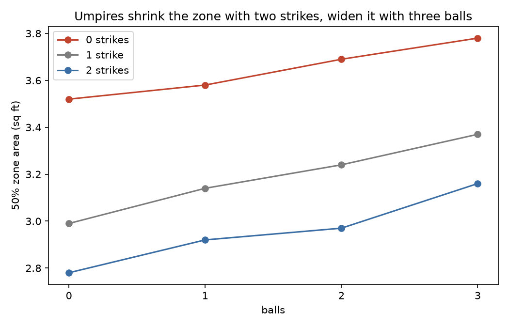
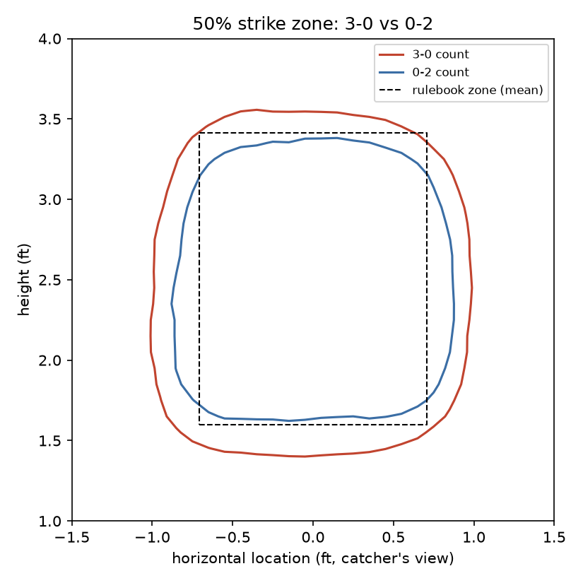
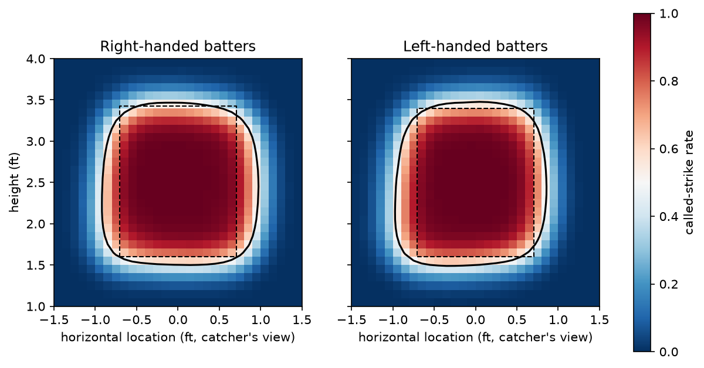
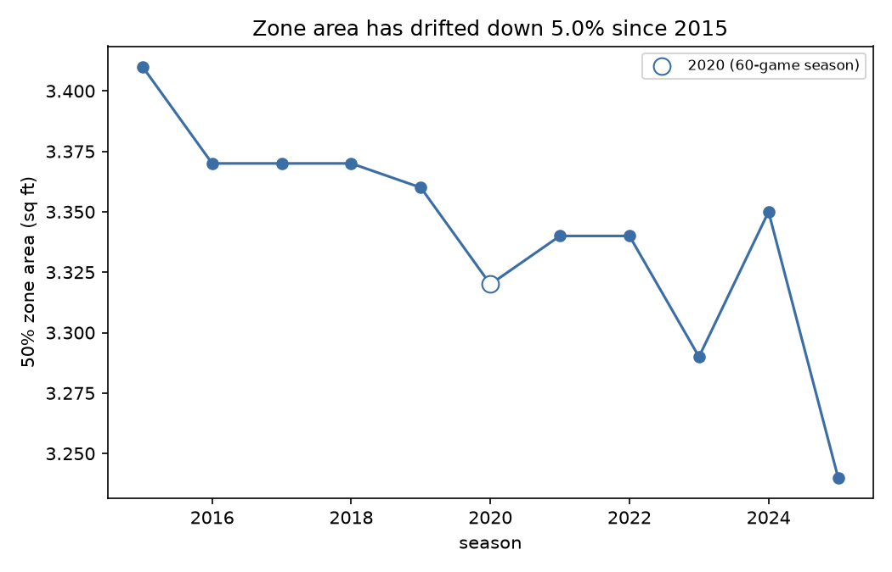
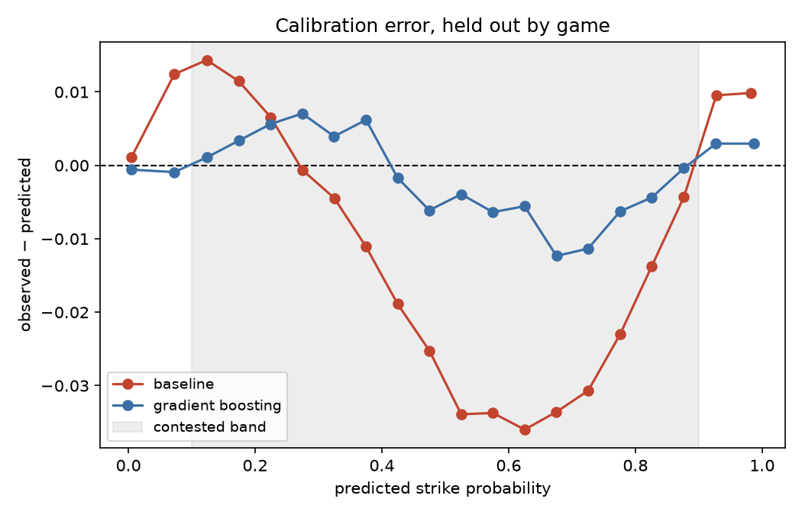
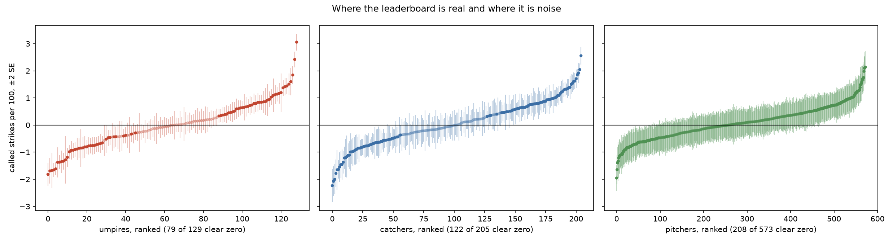
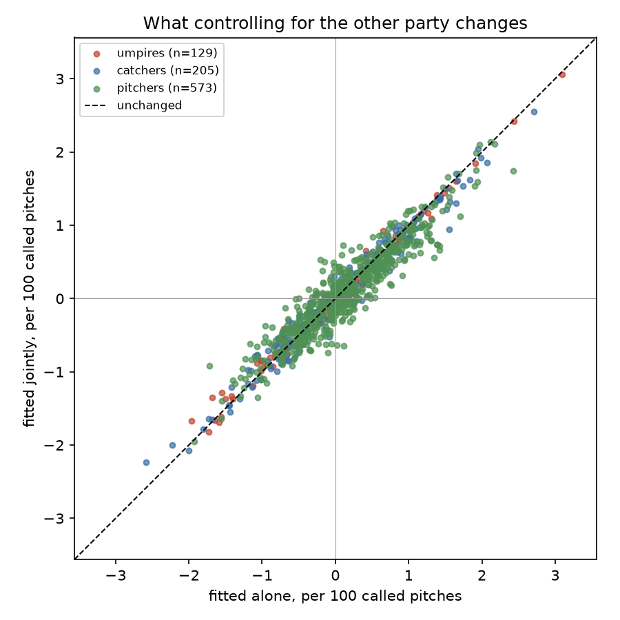
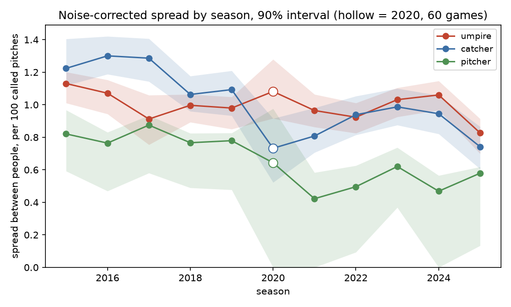
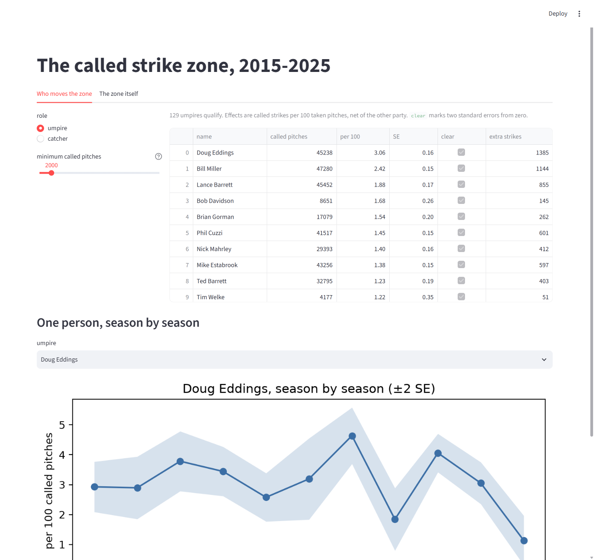

# mlb-strikezone

How the called strike zone actually moves — measured from 3.7 million taken
pitches, 2015–2025.

Every pitch a batter does not swing at is a decision by the home-plate umpire,
recorded to the inch by Statcast. That makes the strike zone one of the few
places in sport where you can measure the gap between a written rule and how it
is enforced. This repo measures that gap.

## Finding

**The zone an umpire calls on 3-0 is 36% larger than the one they call on 0-2**
— 3.78 sq ft against 2.78 sq ft.

The effect is not symmetric. Starting from 0-0 (3.52 sq ft):

| moving from 0-0 to | zone area | change |
| --- | --- | --- |
| 3-0 (three balls) | 3.78 sq ft | +7.4% |
| 0-2 (two strikes) | 2.78 sq ft | −21.0% |

Two strikes take away nearly three times as much zone as three balls add. The
umpire is not simply "evening up the count" — the pull toward not ringing a
hitter up on a borderline pitch is much stronger than the pull toward not
walking them.



Plotted as contours, the two extreme counts barely overlap at the edges. The
0-2 zone sits inside the rulebook box on every side; the 3-0 zone sits outside
it on every side.



Two secondary results:

- **Handedness.** The zone is 3.36 sq ft for right-handed batters against
  3.27 for left-handed ones, and both extend past the outside edge of the plate
  while stopping short on the inside.

  

- **Drift.** The zone has shrunk 5.0% since 2015, from 3.41 to 3.24 sq ft, with
  2025 the smallest of the eleven seasons. Note the y-axis on this chart spans
  about a tenth of a square foot — the trend is consistent, but small next to
  the count effect above.

  

## How the zone is measured

There is no single "the strike zone", so this uses the standard empirical one:
lay a 0.1 ft grid over the plate, and call a cell part of the zone when at
least half the pitches taken there were called strikes. Zone area is the number
of qualifying cells. Everything is computed on taken pitches only
(`called_strike` and `ball`); swings, hit-by-pitches and pitchouts are dropped.

Two choices worth stating plainly:

- **Heights are absolute, not per-batter.** Area is measured in real feet above
  the plate, pooling all batters, so a tall hitter's zone and a short hitter's
  zone are averaged together. The dashed box on the charts is the *mean*
  rulebook zone (2.57 sq ft, from a mean `sz_bot` of 1.60 ft and `sz_top` of
  3.41 ft) and is a visual reference only — the measured zone is wider than it
  partly because pooling batter heights stretches the vertical extent. Compare
  counts to each other, not to the dashed box.
- **Cells are pooled with their neighbours** over a 0.3 ft window before the
  rate is taken. This matters more than it sounds: hitters swing at anything
  near the middle on two strikes, so the heart of the 0-2 zone holds only a
  handful of *taken* pitches per cell. Without pooling, those cells fall under
  the sample floor and blow a hole in the middle of the measured zone, which
  understates two-strike area and inflates the headline number — this analysis
  reported 42.7% before the fix and 36.0% after.

## Modelling the call

Ranking umpires means asking whether a call differs from what the pitch itself
predicted, so the zone has to be modelled before anyone is blamed for it. Two
models, both cross-validated in five folds **grouped on `game_pk`**: pitches
within a game share an umpire, a park and a day's conditions, so splitting on
pitches would leak all of that across the fold boundary and flatter the result.
Every pitch gets a probability from a model that never saw its game.

| | log loss | Brier | AUC |
| --- | --- | --- | --- |
| always predict the base rate | 0.6350 | — | — |
| logistic, location + count + handedness | 0.1869 | 0.0581 | 0.9761 |
| gradient boosting, + pitch type and velocity | 0.1716 | 0.0532 | 0.9798 |

Those headline numbers flatter both models, because two thirds of taken pitches
are obvious. Restricting to the **contested band** — pitches the model itself
puts between 0.1 and 0.9 — is the honest test, and there the two are close:
0.5587 against 0.5503 log loss, over roughly 900,000 pitches, about a quarter
of the data. Neither model discriminates well on a coin flip, which is the
point: those are the calls that are genuinely up to the umpire.

Where they differ is calibration, and it is not a small difference.



The logistic baseline is systematically overconfident straight through the
contested band, peaking at **3.6 percentage points** too high around a
predicted 0.62. The gradient booster stays within 1.2 points across the same
range. That gap is the whole reason attribution uses the boosted model's
residuals: a 3.6-point bias sitting in the middle of the contested band is
larger than the umpire effects being measured, and would be silently
redistributed onto individual umpires as if it were their behaviour.

Note the chart plots *error*, observed minus predicted, rather than observed
against predicted. On a conventional diagonal calibration plot both models look
perfect — the first version of this chart used equal-count bins and put six of
ten points below 0.03, which hid the bow entirely.

## Who moves the zone

With a calibrated probability per pitch, the residual — actual call minus
predicted probability — is what location cannot explain. Three people are in a
position to move it, and all three are fitted to it **together**, in one ridge
regression with every set of effects side by side: the umpire calling, the
catcher receiving, and the pitcher throwing. Fitting any of them separately
double-counts, because each one's tendency sits in the residual of everyone they
work with. The ridge penalty is set at 2,000, which in this design reads in
pitches — someone with 2,000 called pitches keeps about half their raw residual,
which is also the sample floor below which a number isn't worth believing.

Effects are in called strikes per 100 taken pitches, net of the other party.

| umpire | pitches | per 100 | SE | extra strikes |
| --- | --- | --- | --- | --- |
| Doug Eddings | 45,238 | **+3.06** | 0.16 | +1,384 |
| Bill Miller | 47,280 | +2.42 | 0.15 | +1,144 |
| Lance Barrett | 45,452 | +1.85 | 0.17 | +839 |
| … | | | | |
| Mark Wegner | 41,910 | −1.66 | 0.13 | −694 |
| Dana DeMuth | 13,984 | −1.69 | 0.24 | −237 |
| Tom Woodring | 13,354 | **−1.82** | 0.22 | −243 |

| catcher | pitches | per 100 | SE | extra strikes |
| --- | --- | --- | --- | --- |
| Tyler Flowers | 31,597 | **+2.56** | 0.16 | +810 |
| Austin Hedges | 49,954 | +2.05 | 0.11 | +1,023 |
| Patrick Bailey | 22,425 | +1.92 | 0.18 | +430 |
| … | | | | |
| Isiah Kiner-Falefa | 5,065 | −2.07 | 0.28 | −105 |
| Edgar Quero | 4,807 | −2.00 | 0.28 | −96 |
| Ramón Cabrera | 3,670 | **−2.23** | 0.30 | −82 |

| pitcher | pitches | per 100 | SE | extra strikes |
| --- | --- | --- | --- | --- |
| Yusmeiro Petit | 3,476 | **+2.14** | 0.30 | +74 |
| Jesse Chavez | 6,732 | +2.11 | 0.29 | +142 |
| Jon Lester | 9,851 | +2.10 | 0.23 | +207 |
| … | | | | |
| Yusei Kikuchi | 8,226 | −1.65 | 0.27 | −135 |
| Framber Valdez | 8,303 | **−1.95** | 0.24 | −162 |

**Catchers move the zone about as much as umpires do, and pitchers move it about
two thirds as much.** Standard deviations across qualifiers: 0.84 per 100 for
umpires, 0.81 for catchers, 0.59 for pitchers. Who is catching is worth roughly
as much as who is calling, and who is throwing is not far behind.

The pitcher column is the newest of the three and reads the way a scout would
write it. The top is command-first strike-throwers — Petit, Chavez, Lester,
Miley, Keuchel, Davies, deGrom. The bottom is heavy movement — Framber Valdez,
Kikuchi, Steele, Lodolo, Crochet. A pitch that is still moving as it arrives
gets fewer calls than its coordinates deserve, which is a plausible reading and
not one the model was told.

The catcher list is also the closest thing here to external validation. Nothing
in this pipeline knows what pitch framing is — the model sees only location,
count, handedness, pitch type and velocity, and the residual is attributed
blind. It independently returns Flowers, Grandal, Hedges, Mathis, Barnes,
Trevino and Posey at the top, which is essentially the framing leaderboard the
public metrics have been publishing for a decade.

### How much of this ranking is real

Standard errors come from a bootstrap that resamples **whole games**, 200
replicates. The unit matters: within a game the umpire is fixed and the calls
share a park, a day and a zone, so resampling individual pitches would treat
thousands of correlated calls as independent draws and report errors several
times too small.

The median standard error is 0.17 calls per 100 for umpires and 0.20 for
catchers. That is small against the extremes and not against the middle.



Two things follow, and both are constraints on how the table above should be
read:

- **Most of each list is not distinguishable from zero.** 79 of 129 umpires, 122
  of 205 catchers and 208 of 573 pitchers clear two standard errors; the rest are
  indistinguishable from having no effect at all. Every name shown in the tables
  above clears that bar comfortably. The middle of each leaderboard does not.
- **Adjacent ranks are not real.** Separating two people needs roughly 0.5 calls
  per 100 between them. Doug Eddings really is above Bill Miller, but Nick
  Mahrley at +1.41 and Mike Estabrook at +1.37 are one person in two rows, and
  no amount of ranking them will change that.

These are the standard errors of the shrunken estimate — they describe how much
the ridge coefficient would move under resampling, not the full uncertainty
about a person's true effect, which also carries the shrinkage bias.

### The joint fit changed less than expected

Worth stating plainly, because it argues against the design decision that
produced it. Comparing the joint estimates against fitting each role *alone
with identical shrinkage* — which isolates the partner control from the
regularisation — the difference is about **0.05 calls per 100**, against effects
that range over ±2.5.



Both roles land on the diagonal. The confounding is real but small in this
sample, because over eleven seasons umpires work with many catchers and
catchers with many umpires, so partners largely average out. Ridge shrinkage
moves the numbers three to seven times further than the joint fit does (0.16
per 100 for umpires, 0.36 for catchers).

That is a reason to trust the leaderboard, not a reason to skip the joint fit:
the correction being small is a finding, and it isn't one you can assert
without doing the fit. It would not stay small for a single season, or for a
catcher who caught for one crew.

### How much of framing is really the pitcher

Adding pitchers was meant to answer a specific worry: that a catcher's number
was quietly absorbing his pitching staff's command. It does, but less than
feared. Against the two-role fit, the catcher spread shrinks **4.0%** and the
individual numbers correlate at 0.988, moving 0.09 per 100 at the median. The
umpire column barely notices, shrinking 1.2% at a correlation of 0.999. The
framing leaderboard survives: Flowers 2.59 to 2.56, Hedges 1.97 to 2.05.

The exception proves the mechanism, and it is worth the detour. The biggest
mover by a distance is **David Ross, whose framing number falls from +1.64 to
+0.95** once pitchers are in the fit. Ross was Jon Lester's personal catcher,
and Lester lands at +2.10 on the pitcher list above. In this data **44.8% of
every called pitch Ross caught was thrown by Lester**, against a median of 9.8%
for a typical qualifying catcher's most-caught pitcher — the 99th percentile of
battery concentration.

So the confounding is real and it is specific. Catchers with normal, varied
staffs barely move, because the pitchers average out the same way the partners
did before. Catchers welded to one arm move a lot. A leaderboard without
pitchers in it is not wrong everywhere; it is wrong exactly where a catcher
caught the same man half the time.

### The players converged. The umpires did not.

The leaderboard above pools eleven seasons into one number per person, which
hides whether the pool is changing. Refitting one season at a time answers that,
with two adjustments the result depends on entirely:

- **A far lighter ridge penalty, 100 rather than 2,000.** Shrinkage is roughly
  `n / (n + alpha)`, and a season holds an eighth of an umpire's pooled
  workload — 2020 a twenty-fifth. The pooled penalty would shrink short seasons
  hardest and manufacture a convergence trend out of nothing but sample size.
  At 100 the shrinkage stays under 5% in every season.
- **The spread is corrected for estimation noise.** The observed standard
  deviation of a season's estimates carries their own standard errors on top of
  the real variation, and carries more of them when there is less data. The
  reported spread subtracts the mean squared error. Without this 2020 is the
  *most* variable umpire season in the sample (raw 1.29, corrected 1.09) purely
  because it is the shortest.



Each season's spread carries a bootstrap interval over resampled games, drawn as
a band above, and seasons are weighted by their precision when the trend is
fitted, so 2020's wide band does not pull the line like a full season's narrow
one.

Bootstrapping this particular statistic has a trap in it worth naming, because
the first two attempts fell in. The observed effects already carry one helping
of estimation noise; a replicate resamples them and carries a second. Subtract
one helping from a replicate, as the definition of the statistic says to, and
the bootstrap converges on the **uncorrected** standard deviation rather than on
the statistic — about 0.11 too high, far enough that every point estimate landed
outside its own percentile bounds. Replicates take the correction twice. After
that the draws sit 0.03 from the statistic and all 33 point estimates are inside
their intervals, so the bounds mean what they say and are free to be asymmetric.

The standard errors behind that correction are closed-form and clustered on the
game rather than bootstrapped, which is both faster and applies one estimator at
both levels. They run about 1.10x the bootstrap errors — the gap is the ridge
shrinkage the bootstrap sees and a plain mean does not.

| | 2015 | 2025 | slope per season |
| --- | --- | --- | --- |
| catchers | 1.22 | 0.74 | **−0.047 ± 0.009** |
| pitchers | 0.82 | 0.58 | **−0.035 ± 0.009** |
| umpires | 1.13 | 0.83 | −0.013 ± 0.008 |

**The catcher spread has collapsed by about 40%, and the trend is five standard
errors from flat.** In 2016 the gap between a good and a bad framer was nearly
twice what it is now. **Pitchers have compressed too**, from 0.82 to 0.58 at
just under four standard errors. Both are consistent with these becoming known
and priced skills over the period — a team that can measure framing stops
employing catchers who are bad at it, and the same logic reaches command —
though this data can show the compression and not the cause.

The pitcher line deserves a caveat the other two do not. Its correction is
subtracting most of the variance: a raw spread around 1.1 against a median
standard error of 0.84, so the reported 0.5 to 0.8 is a difference between two
similar numbers. The intervals show it, touching zero in three seasons. The
direction is well established; the level is not.

**The umpire spread is not established as moving.** The end points tempt a
different story: 1.13 down to 0.83 reads as a 27% decline. But the slope is
−0.013 ± 0.008, and the middle of the series wobbles between 0.91 and 1.06 with
no direction — 2023 and 2024 are both *higher* than 2017, and their bands
overlap almost everything.

That is 1.7 standard errors, which is short of the conventional bar but close
enough that "umpires are not converging" would be overclaiming in the other
direction. The honest reading is that eleven seasons cannot separate a slow
umpire convergence from none at all, while the same eleven seasons settle both
player questions.

The contrast is the interesting part. Everyone here is being graded — MLB grades
its umpires too — but the two groups a front office can hire and release have
visibly compressed, and the group it cannot has not. That is what selection
looks like when it is available on one side of the plate and not the other.

The umpire conclusion has now survived four different ways of estimating the
uncertainty — equal weights, precision weights from a nested bootstrap,
precision weights from the corrected one, and the whole thing refitted with
pitchers in the model — which moved the slope between −0.012 and −0.014 and
never moved it across the bar.

## Poking at it yourself

Everything above is a fixed view of the data. `app.py` is the interactive one —
filter the leaderboard by role and sample floor, pull up any individual's season
by season history, and redraw the zone for any count and batter side.



```bash
uv run streamlit run streamlit_app.py
```

It says which pipeline step to run if something is missing, rather than failing
on an empty directory.

The app reads `app_data/`, not `data/`. That directory is committed and totals
about half a megabyte, because the zone tab does not need 3.7 million pitches —
it needs a 40 by 40 grid per count and batter side, which is 39 grids. `export.py`
precomputes them, turning a 154 MB dependency into 211 KB and letting the app be
deployed from this repo with nothing else attached. `data/` stays gitignored and
holds the tables everything was actually measured from.

## Reproducing

Python 3.12 via [uv](https://docs.astral.sh/uv/). Data is pulled from Baseball
Savant and is not committed.

```bash
uv sync
uv run python src/mlb_strikezone/ingest.py 2015 2016 2017 2018 2019 2020 2021 2022 2023 2024 2025
uv run python src/mlb_strikezone/features.py
uv run python src/mlb_strikezone/umpires.py
uv run python src/mlb_strikezone/analysis.py
uv run python src/mlb_strikezone/model.py
uv run python src/mlb_strikezone/attribution.py
uv run python src/mlb_strikezone/drift.py
uv run python src/mlb_strikezone/export.py
```

The ingest step is the slow one — it pulls a month at a time and caches one
parquet per season under `data/raw/`, skipping any season already present.
`features.py` builds `data/processed/called_pitches.parquet` (3.7M rows).
`umpires.py` is quick — one MLB Stats API call per season gets the whole
umpiring crew, so 11 requests cover 25,193 games. `analysis.py` prints the
tables above and writes the four zone figures.

`model.py` is the other slow one — ten model fits over 3.7M pitches. It writes
`data/processed/predictions.parquet` and then reports from that file, so a
rerun reuses the saved predictions and only re-derives the scores and the
calibration chart. Pass `--refit` to actually fit again.

`attribution.py` reads those predictions back, fits the joint leaderboard and
writes `data/processed/attribution.parquet`. The ridge itself takes seconds —
it is sparse, two non-zeros per row — and the 200 bootstrap replicates behind
the standard errors take about three minutes.

Each module self-tests without touching the data:

```bash
uv run python src/mlb_strikezone/ingest.py --check
uv run python src/mlb_strikezone/features.py --check
uv run python src/mlb_strikezone/umpires.py --check
uv run python src/mlb_strikezone/analysis.py --check
uv run python src/mlb_strikezone/model.py --check
uv run python src/mlb_strikezone/attribution.py --check
uv run python src/mlb_strikezone/drift.py --check
uv run python src/mlb_strikezone/export.py --check
uv run python src/mlb_strikezone/app.py --check
```

## Limitations

- The 50% grid zone is descriptive, not a model. It cannot separate the count
  effect from anything correlated with count — pitch type, velocity, and where
  catchers set up all shift with the count, and none of that is controlled for
  here.
- 2020 is a 60-game season and is roughly a third the sample of the others.
- The model knows where the pitch was and what it was, not who was behind the
  plate or who caught it. That is deliberate: those are the effects to be
  measured, so they must stay out of the prediction.
- Attribution is a linear fit on residuals, not a logistic one with an offset.
  The residual is heteroscedastic, so the estimates are interpretable but not
  efficient. The standard errors are bootstrapped rather than read off the fit,
  so they do not inherit that inefficiency, but they describe the shrunken
  estimate and not the shrinkage bias.
- A catcher's effect still absorbs anything correlated with him that the model
  does not see. The pitcher is now controlled for, but his team's park and the
  pitch mix he calls are not. It is a catcher-shaped residual, not a measurement
  of framing skill in isolation.
- The three roles are separable only because crews, catchers and staffs cross
  over across eleven seasons. Over one season, or for a catcher welded to one
  pitcher, they are not — which is exactly what the David Ross case above shows.

## Next

The pipeline is complete end to end: ingest, called-pitch table, umpires,
descriptive zone, model, attribution. What would sharpen it, roughly in order
of value per unit of work:

- **Batter effects.** The one participant still unmodelled. A hitter who takes
  close pitches presents the umpire with a different mix than one who swings at
  them, and any of that which survives the location model is currently sitting
  in someone else's column.
- **Park effects.** Sightlines and backdrops differ, and every catcher plays half
  his games in one building, so park is confounded with catcher in the same way
  the pitcher was.
